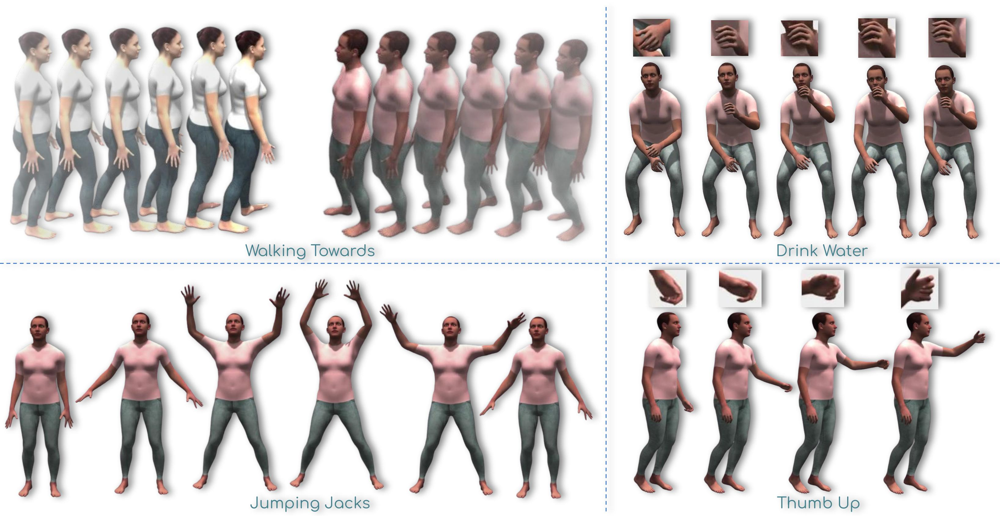
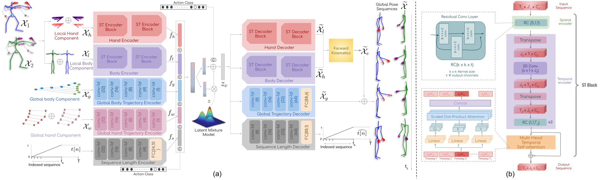

# DSAG
The official pytorch implementation of [**DSAG: A Scalable Deep Framework for Action-Conditioned Multi-Actor Full Body Motion Synthesis**](https://arxiv.org/abs/2110.11460), [WACV 2023](https://wacv2023.thecvf.com/home).
Please visit our [**webpage**](https://skeleton.iiit.ac.in/dsag) for more details.




## Table of contents:
1. Description
1. How to use

## Description
We introduce DSAG, a controllable deep neural framework for action-conditioned generation of full body multi-actor variable duration actions. To compensate for incompletely detailed finger joints in existing large-scale datasets, we introduce full body dataset variants with detailed finger joints. To overcome  shortcomings in existing generative approaches, we introduce dedicated representations for encoding finger joints. We also introduce novel spatiotemporal transformation blocks with multi-head self attention and specialized temporal processing. The design choices enable generations for a large range in body joint counts (24 - 52), frame rates (13 - 50), global body movement (in-place, locomotion) and action categories (12 - 120), across multiple datasets (NTU-120, HumanAct12, UESTC, Human3.6M).  Our experimental results demonstrate DSAG's significant improvements over state-of-the-art, its suitability for action-conditioned generation at scale. Code and models will be released.




## How to use
#### Requirements
```
$ pip install -r requirements.txt 
```

### Data Preprocessing 
##### NTU-Xpose dataset
We derive `NTU-Xpose` dataset for our experiments on the NTU dataset. To extract NTU-Xpose dataset, [ExPose](https://github.com/vchoutas/expose) pose estimation used on the `NTU RGBD-120` dataset. But [ExPose](https://github.com/vchoutas/expose) extracts only the local pose, i.e. human pose, with respect to the root joint. For Extracting the position of the human pose at the global trajectory, we use the NTU-120 Kinect dataset. The whole process of data preprocessing is demonstrated below.

**Step 1:**
Extract `NTU RGBD-120` skeleton using [ExPose](https://github.com/vchoutas/expose) pose estimation, and place it in `./dataset/smpl` directory. Then run the following,
```
$ mkdir -p dataset/smpl/
$ python ./Data_preprocessing/data_preprosessing_2_persons_init_75.py 
```
 **Step 2**
 Run the following for extracting and mapping root trajectory from 'NTU-120' dataset.
 ```
$ python ./Data_preprocessing/map_2_persons.py 
```

**step 3**
In this step we apply optimization based temporal consistency,
 ```
$ python ./Data_preprocessing/preprocess_finger_motion_2_person.py
```


### Training
**You can skip this step if you want to use our pretrained model.**
To train DSAG from scratch run `pose.py`. Details of DSAG model can be found in `model/`. For training DSAG run the following,
 ```
$ python pose.py
```


### Visualization
If you want to play with pretrained DSAG model please see `visualization.ipynb`. 


### Evaluation
Implementation of evaluation metrics can be found in the `metrics` directory.


#### Bibtex
Please cite our paper if you end up using it for your own research:
```
@InProceedings{DSAG,
title = {DSAG: A Scalable Deep Framework for Action-Conditioned Multi-Actor Full Body  Motion Synthesis},
author = {Debtanu Gupta, Shubh Maheshwari, Sai Shashank Kalakonda, Manasvi Vaidyula, Ravi Kiran Sarvadevabhatla},
booktitle = {WACV},
year = {2023},
}
```
